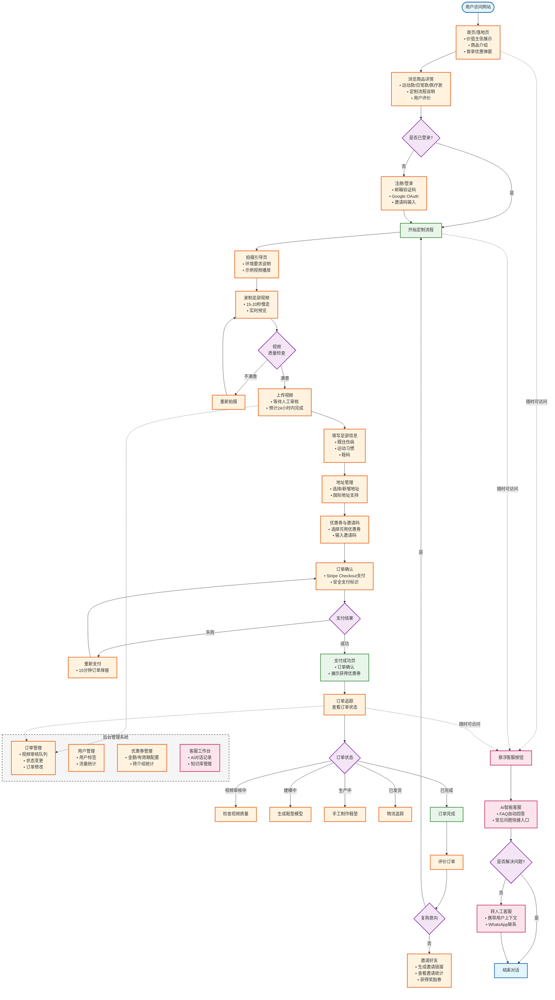

# Foot X 用户流程图 (User Flow)

## 完整用户操作流程

---

## 流程说明

| 阶段 | 核心用户目标 | 关键决策点 |
|------|-------------|-----------|
| **发现与注册** | 了解产品价值，判断是否适合自己 | 首单优惠弹窗引导注册 |
| **定制与下单** | 拍摄合格视频，完成定制订单 | 视频质量检查 → 支付成功 |
| **订单追踪** | 了解订单处理进度，等待收货 | 5个状态节点的可视化展示 |
| **客服支持** | 快速获得问题解答 | AI客服 → 人工客服的转接机制 |

## 样式定义

- 🔵 **蓝色节点**: 开始/结束节点
- 🟠 **橙色节点**: 用户操作/处理节点
- 🟣 **紫色节点**: 决策判断节点
- 🟢 **绿色节点**: 成功完成节点
- 🔴 **粉色节点**: 客服支持节点
- ➡️ **实线箭头**: 主流程路径
- ➡️ **虚线箭头**: 客服入口（随时可访问）

## 对应 PRD 章节

- 阶段一: [1.1 浏览商品](./PRD.md#用户任务-11浏览商品)、[1.2 注册/登录](./PRD.md#用户任务-12注册登录)
- 阶段二: [2.1 足部视频采集](./PRD.md#用户任务-21足部视频采集)、[2.5 支付](./PRD.md#用户任务-25支付)
- 阶段三: [3.1 查看订单](./PRD.md#用户任务-31查看订单)、[3.3 邀请好友](./PRD.md#用户任务-33邀请好友)
- 阶段四: [4.1 智能客服咨询](./PRD.md#用户任务-41智能客服咨询)、[4.2 人工客服支持](./PRD.md#用户任务-42人工客服支持)
- 后台管理: [5.1-5.5 后台管理功能](./PRD.md#阶段五后台管理)

---

*文档版本: v1.0*
*创建日期: 2026-03-28*
*对应 PRD: v1.0*
