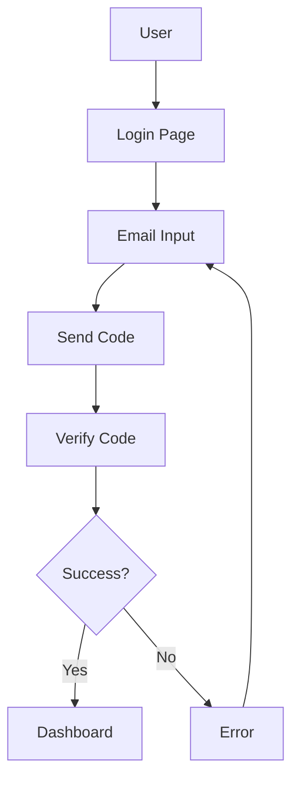

# Authentication Flow

## State Machine Definition

```state-machine
name: Authentication Flow
id: auth
initial: idle
states:
  idle:
    type: initial
    description: User not logged in, showing login entry
    ui: Login page

  email_input:
    description: User entering email address
    ui: Email input form

  code_sent:
    description: Verification code sent, waiting for input
    ui: Verification code input

  authenticating:
    type: processing
    description: Verifying credentials
    ui: Loading spinner

  authenticated:
    type: success
    description: Login successful
    ui: Redirect to home

  error:
    type: error
    description: Verification failed
    ui: Error message with retry option

transitions:
  - from: idle
    trigger: click_login
    to: email_input
    description: Click login button

  - from: email_input
    trigger: submit_email
    to: code_sent
    guard: email_valid
    description: Submit valid email

  - from: email_input
    trigger: submit_email
    to: email_input
    guard: "!email_valid"
    description: Invalid email, stay on form

  - from: code_sent
    trigger: submit_code
    to: authenticating
    description: Submit verification code

  - from: authenticating
    trigger: auth_success
    to: authenticated
    description: Authentication successful

  - from: authenticating
    trigger: auth_failed
    to: error
    description: Authentication failed

  - from: error
    trigger: retry
    to: email_input
    description: Try again

  - from: error
    trigger: retry_code
    to: code_sent
    description: Resend verification code

links:
  - state: authenticated
    targetMachine: order
    targetState: browse
    description: After login, user can browse orders
```

## Order Flow

```state-machine
name: Order Flow
id: order
initial: browse
states:
  browse:
    type: initial
    description: User browsing products
    ui: Product catalog

  cart:
    description: Items in cart
    ui: Shopping cart

  checkout:
    type: processing
    description: Processing order
    ui: Checkout form

  completed:
    type: success
    description: Order completed
    ui: Order confirmation

  cancelled:
    type: error
    description: Order cancelled
    ui: Cancellation notice

transitions:
  - from: browse
    trigger: add_to_cart
    to: cart
    description: Add item to cart

  - from: cart
    trigger: checkout
    to: checkout
    description: Proceed to checkout

  - from: checkout
    trigger: payment_success
    to: completed
    description: Payment successful

  - from: checkout
    trigger: payment_failed
    to: cart
    description: Payment failed, return to cart

  - from: cart
    trigger: cancel
    to: cancelled
    description: Cancel order
```

## Architecture Diagram



See also: [Design System](./design-system.md) and [PRD](../PRD/PRD.md)
